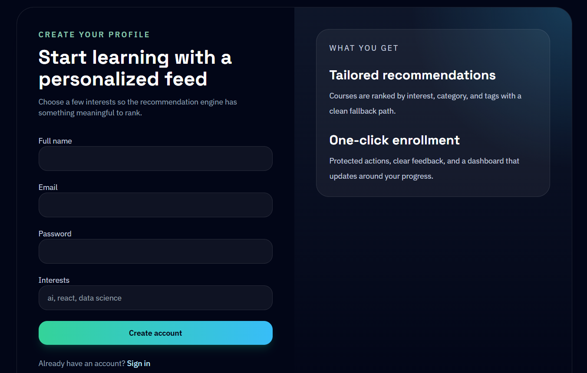
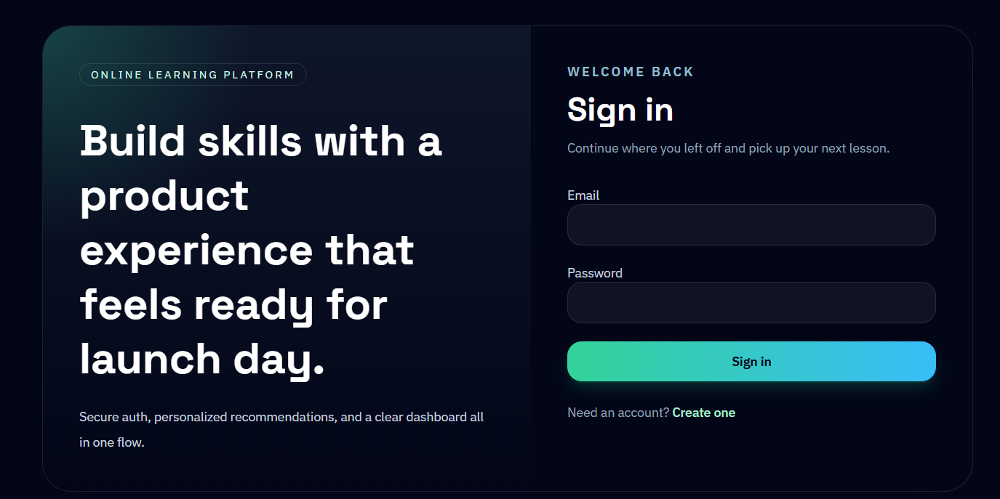
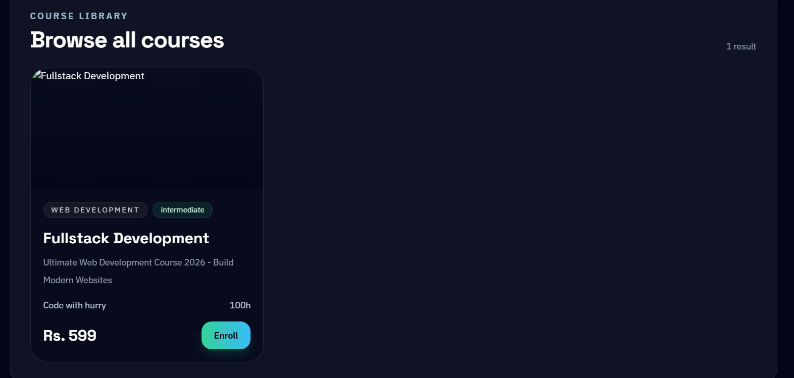
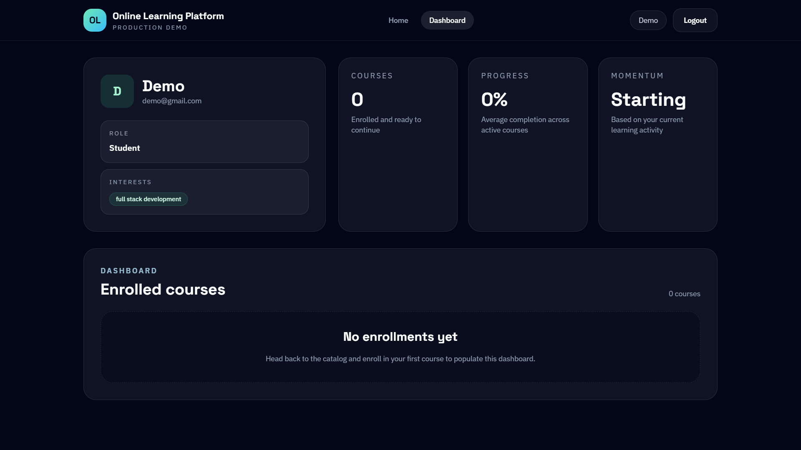
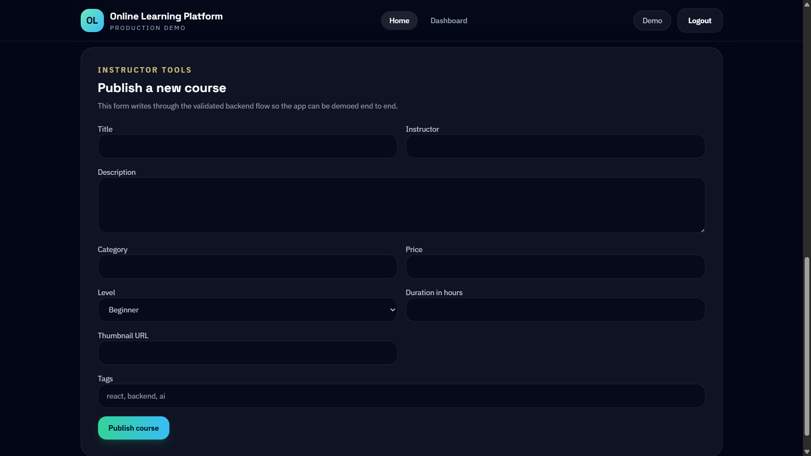
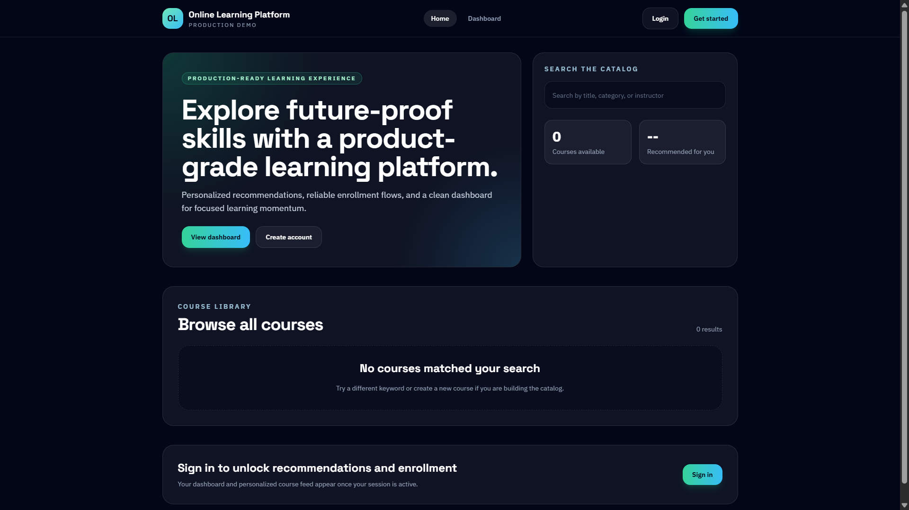

# Online Learning Platform

A production-oriented MERN online learning platform with secure authentication, course publishing, enrollment workflows, AI-style course recommendations, and a polished responsive dashboard.

## Features

- JWT authentication with persisted sessions and protected routes
- Course catalog with validated course creation flow
- Enrollment system connected to the user dashboard
- Recommendation engine with interest-based scoring, relevance sorting, and fallback suggestions
- Responsive Tailwind UI with reusable components, skeleton states, toast notifications, and empty states
- Production backend middleware for security, validation, rate limiting, logging, and centralized errors
- Ready-to-deploy environment setup for Render and Vercel

## Tech Stack

- Frontend: React, React Router, Axios, Tailwind CSS
- Backend: Node.js, Express, MongoDB, Mongoose
- Auth: JWT, bcryptjs
- Validation and security: express-validator, helmet, cors, express-rate-limit
- Logging and observability: morgan, winston
- Testing: Node test runner, supertest

## Folder Structure

```text
.
|-- client
|   |-- src
|   |   |-- components
|   |   |-- context
|   |   |-- pages
|   |   |-- services
|   |   `-- utils
|   |-- .env.example
|   |-- postcss.config.js
|   `-- tailwind.config.js
|-- server
|   |-- src
|   |   |-- __tests__
|   |   |-- config
|   |   |-- controllers
|   |   |-- middleware
|   |   |-- models
|   |   |-- repositories
|   |   |-- routes
|   |   |-- services
|   |   |-- utils
|   |   `-- validators
|   |-- .env.example
|   `-- server.js
`-- README.md
```

## Local Setup

### 1. Install dependencies

```bash
cd server
npm install

cd ../client
npm install
```

### 2. Configure environment variables

Backend file: `server/.env`

```env
PORT=5000
NODE_ENV=development
MONGO_URI=mongodb://127.0.0.1:27017/online-learning-platform
JWT_SECRET=replace-with-a-long-random-secret
JWT_EXPIRES_IN=1d
CLIENT_URL=http://localhost:3000
RATE_LIMIT_WINDOW_MS=900000
RATE_LIMIT_MAX=150
LOG_LEVEL=info
```

Frontend file: `client/.env`

```env
REACT_APP_API_URL=http://localhost:5000/api
```

### 3. Run the app

Backend:

```bash
cd server
npm run dev
```

Frontend:

```bash
cd client
npm start
```

## API Highlights

- `POST /api/auth/register`
- `POST /api/auth/login`
- `GET /api/auth/me`
- `GET /api/courses`
- `POST /api/courses`
- `POST /api/courses/:courseId/enroll`
- `GET /api/recommendations/:userId`
- `GET /api/user/dashboard`
- `GET /api/health`

## UI Component Structure

- `Navbar`: global navigation, profile badge, logout
- `CourseCard`: reusable catalog/recommendation card with hover states
- `Button`: shared CTA variants and loading state
- `Loader`: lightweight global loading state
- `SkeletonCard`: course list placeholder while fetching
- `EmptyState`: reusable blank-state container
- `PrivateRoute`: route guard for authenticated pages

## Screenshots

### 🟢 Client Terminal


### 🟢 Server Terminal


### 🟢 Registration


### 🟢 Login


### 🟢 Available Courses


### 🟢 User Profile


### 🟢 Launch Courses


### 🟢 Dashboard


## Deployment Notes

- Frontend deploy target: Vercel
- Backend deploy target: Render
- Set `CLIENT_URL` on the backend to the Vercel domain
- Set `REACT_APP_API_URL` on the frontend to the Render backend URL plus `/api`
- Use MongoDB Atlas for production database hosting

## Critical Improvements Added

- Clean backend layering with controllers, services, repositories, validators, and shared middleware
- Centralized error handling and request validation
- Helmet, rate limiting, safer CORS, structured logging, and health checks
- Improved MongoDB indexing for users and courses
- Auth persistence with context and protected dashboard routing
- Recommendation scoring by category, tags, and title relevance with fallback ordering
- Responsive FAANG-style UI with reusable components and better loading/error UX

## Future Improvements

- Role-based authorization for instructor-only course publishing
- Real payment gateway integration with Stripe or Razorpay
- Course detail pages and lesson-level progress persistence
- Refresh-token flow and email verification
- E2E tests with Playwright or Cypress
- Analytics, search, and admin moderation tools


## 👨‍💻 Author

Amiya Krishna Chaurasiya

B.Tech CSE Student

Aspiring Data Scientist and AI/ML Engineer

GitHub: https://github.com/Amiya-Krishna

LinkedIn: https://www.linkedin.com/in/amiya-krishna

## ⭐ Support

If you like this project:

⭐ Star the repository
🍴 Fork it
🤝 Contribute
